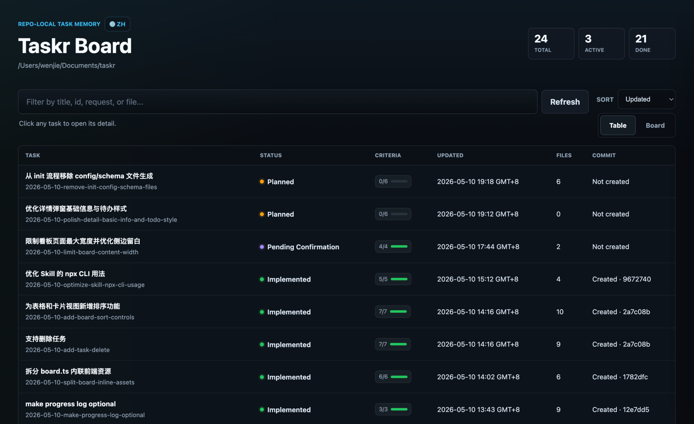
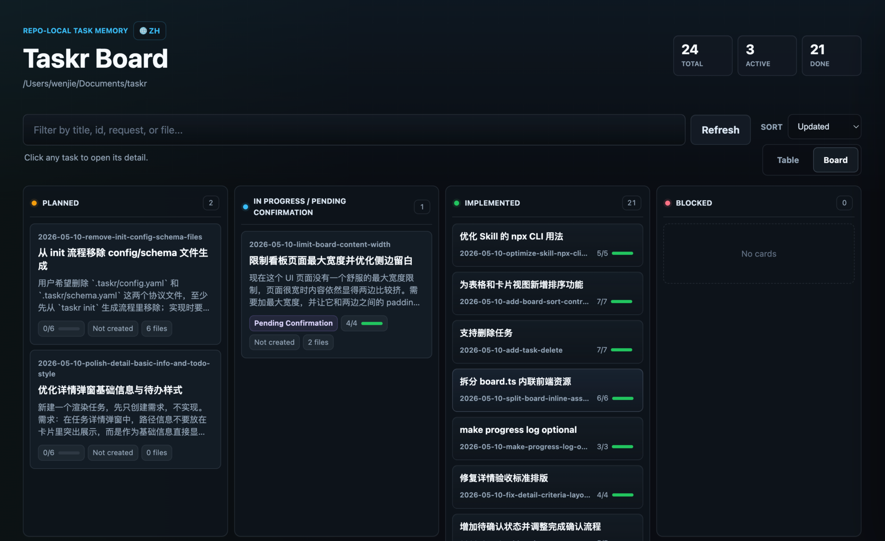
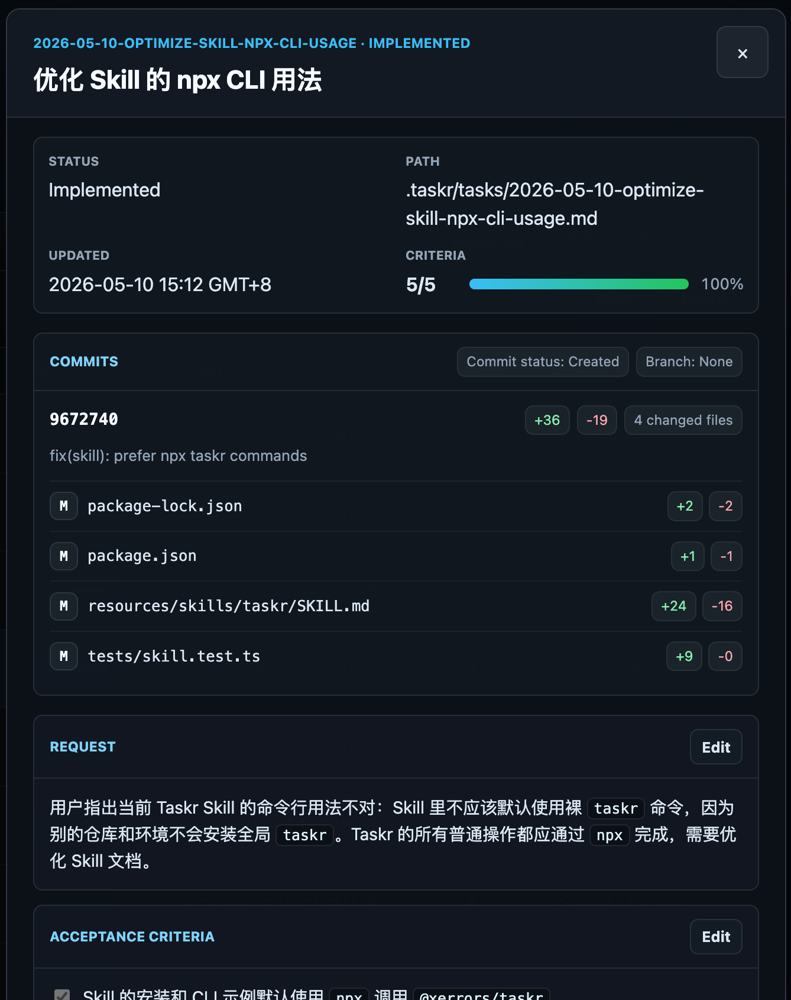
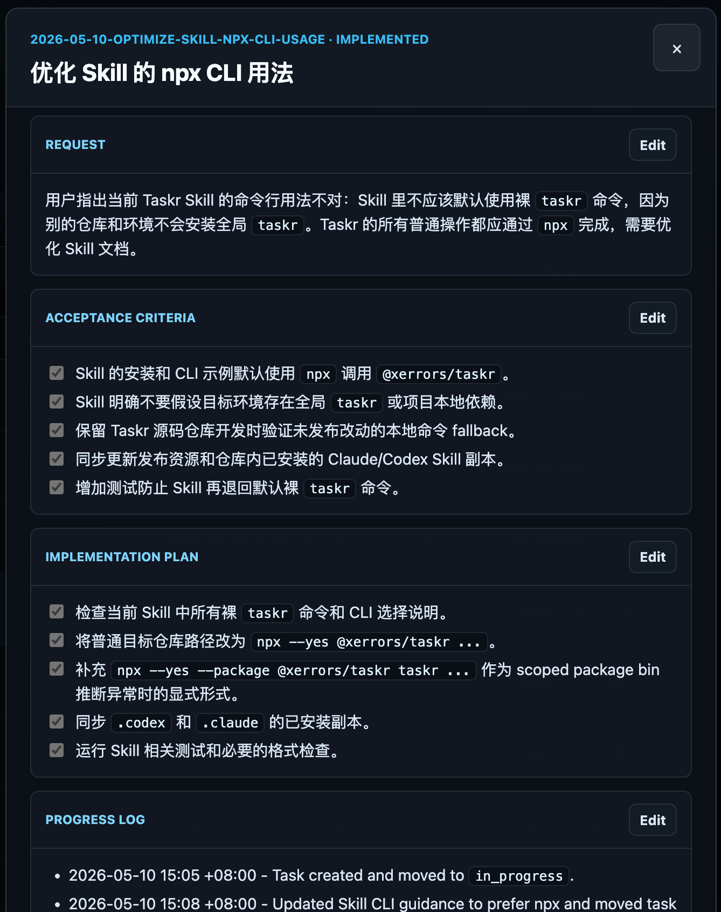

# Taskr

[](https://www.npmjs.com/package/@xerrors/taskr)
[](https://nodejs.org/)

[中文说明](README.zh-CN.md)

Taskr is a repo-local task protocol, Skill, and local board for AI-assisted software development.

It gives coding agents a durable way to turn chat requests into tracked Markdown task files inside your repository: request, acceptance criteria, implementation plan, checklist progress, optional notes, verification, related files, commits, and completion summary.

No SaaS. No database. No project-management ceremony. Just `.taskr/`.

## What Taskr Gives You

- A Claude or Codex Skill that teaches the agent when and how to track work.
- Human-readable task files under `.taskr/tasks/*.md`.
- A small workflow built for agent collaboration: `planned`, `in_progress`, `pending_confirmation`, `implemented`, `blocked`.
- A local board for scanning tasks, switching between table and Kanban views, reviewing commit context, and editing task sections.
- An npm-distributed CLI that runs through `npx`, so target repositories do not need to add Taskr as a dependency.

## Quick Start

Install the Skill once, then ask your agent to use Taskr when you want tracked implementation work.

For Claude Code across your projects:

```bash
npx --yes @xerrors/taskr install-skill claude --scope user
```

For Codex across your projects:

```bash
npx --yes @xerrors/taskr install-skill codex --scope user
```

For a project-local install, run the same command without `--scope user` from the repository:

```bash
npx --yes @xerrors/taskr install-skill claude
npx --yes @xerrors/taskr install-skill codex
```

Then ask your agent for tracked work:

```text
/taskr implement user invitation flow
```

The Skill will initialize `.taskr/` the first time Taskr is used in a repository.

## Agent Workflow

Taskr is designed for the moment when a chat request becomes real repository work.

1. You ask the agent to implement, fix, refactor, investigate, or plan something with Taskr.
2. The agent records the request, acceptance criteria, and a short plan in `.taskr/tasks/`.
3. The agent keeps the task file updated while it works.
4. When implementation and verification are done, the task moves to `pending_confirmation`.
5. After you confirm the result, the task can be marked `implemented` and linked to the commit.

Because the task is plain Markdown, it remains useful in Git history, code review, handoff, and future agent sessions.

## Board

Open a local board for the current repository:

```bash
npx --yes @xerrors/taskr board --open
```

The board reads `.taskr/tasks/*.md` directly. It supports automatic local-file refresh, search, table and Kanban views, sorting by created or updated time, status summaries, commit and file diff context, manual refresh, section editing, lightweight Markdown rendering, and confirmed task deletion.

### Table View



### Kanban View



### Task Detail Drawer

<p>
  
  
</p>

## CLI

Use the CLI directly when you want to initialize Taskr, create tasks yourself, inspect local state, or script repository checks:

```bash
npx --yes @xerrors/taskr init
npx --yes @xerrors/taskr new "implement user invitation flow" --status in_progress
npx --yes @xerrors/taskr list
npx --yes @xerrors/taskr doctor
npx --yes @xerrors/taskr validate
```

Get help for any command:

```bash
npx --yes @xerrors/taskr --help
npx --yes @xerrors/taskr new --help
npx --yes @xerrors/taskr complete --help
```

The npm package is [`@xerrors/taskr`](https://www.npmjs.com/package/@xerrors/taskr) and exposes a `taskr` binary.

## Doctor

`taskr doctor` checks whether the current repository is ready for Taskr:

- `.taskr/` initialization.
- Config, schema, and task directory presence.
- Task Markdown validation.
- Project-level Claude/Codex Skill installation clues.
- Local Node runtime compatibility.

When setup feels off, start here:

```bash
npx --yes @xerrors/taskr doctor
```

## What Gets Created

```text
.taskr/
├── config.yaml
├── schema.yaml
├── templates/
│   └── task.md
└── tasks/
    └── 2026-05-10-implement-user-invitation-flow.md

.claude/
└── skills/
    └── taskr/
        └── SKILL.md

.codex/
└── skills/
    └── taskr/
        └── SKILL.md
```

`taskr` treats `.taskr/tasks/*.md` as the source of truth. The board reads task Markdown files directly and does not require an index cache.

`taskr install-skill <target>` installs the same Taskr Skill content for each agent platform. For project scope, Claude uses `.claude/skills/taskr/SKILL.md` and Codex uses `.codex/skills/taskr/SKILL.md`. For user scope, Claude uses `~/.claude/skills/taskr/SKILL.md`; Codex uses `$CODEX_HOME/skills/taskr/SKILL.md` when `CODEX_HOME` is set, otherwise `~/.codex/skills/taskr/SKILL.md`.

New task ids generated by `taskr new` are prefixed with the local date, such as `2026-05-10-implement-user-invitation-flow`, so `.taskr/tasks/` remains easy to scan from the filesystem. Explicit `--id` values are preserved as long as they use lower-kebab-case.

## Task States

```text
planned
in_progress
pending_confirmation
implemented
blocked
```

`pending_confirmation` means an agent completed implementation and verification and is waiting for the user to confirm submission or completion. `implemented` means the user has confirmed that the task can be treated as done.

The board keeps `in_progress` and `pending_confirmation` in one visual column while preserving their separate task statuses. Legacy `closed` task files are treated as completed in the board view, but `closed` is no longer a valid protocol status.

## Local Development

Inside this repository:

```bash
npm install
npm run build
node dist/cli.js install-skill claude
node dist/cli.js install-skill codex
node dist/cli.js init
node dist/cli.js board
node dist/cli.js validate
```

Run the full project check:

```bash
npm run check
```

## Commit Convention

When creating commits for a task, keep the first line as a normal summary and put the Taskr reference in the footer:

```text
Taskr: <task-id>
```

Example:

```text
feat(invitation): add invitation creation flow

Taskr: 2026-05-10-user-invitation
```
